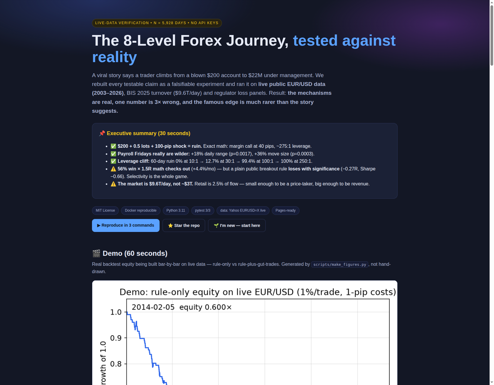
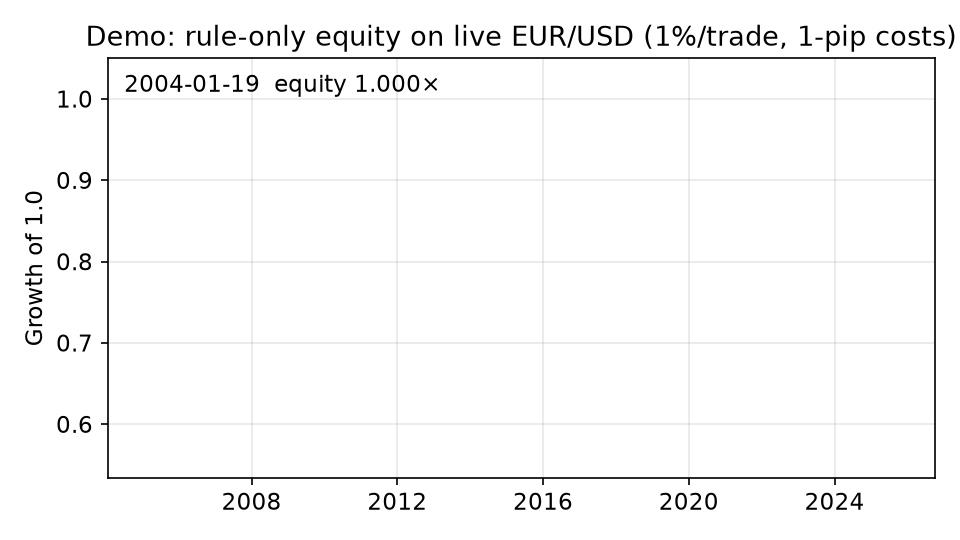
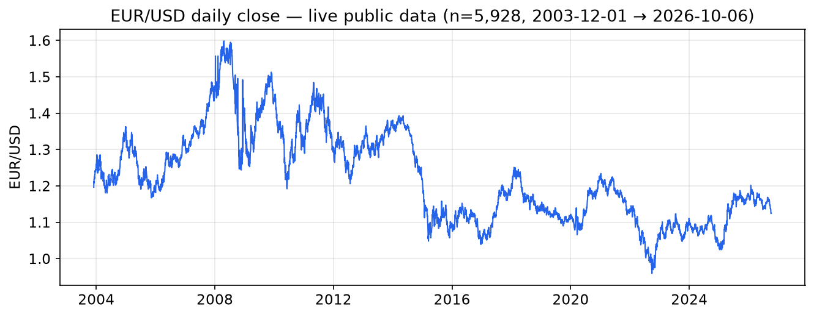
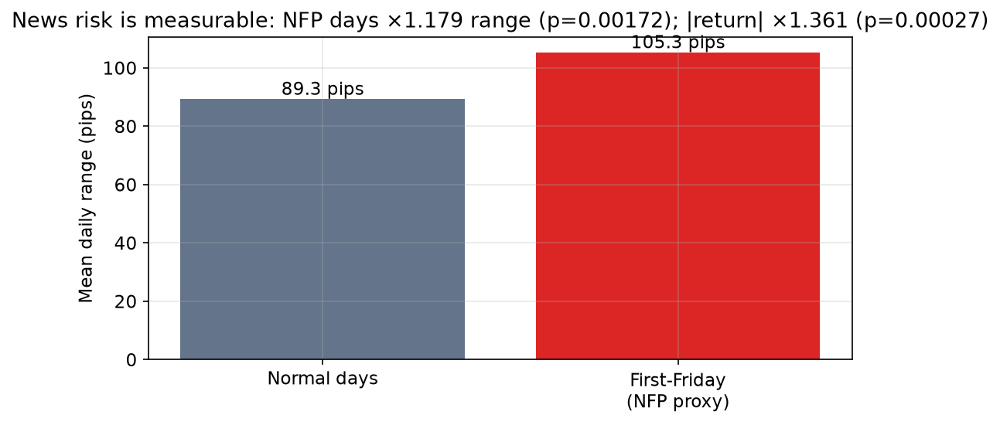
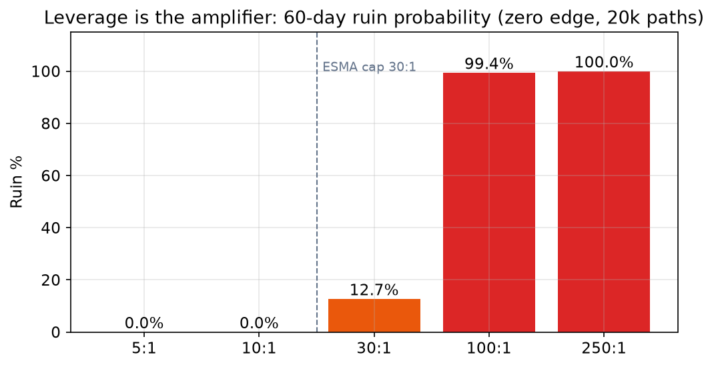
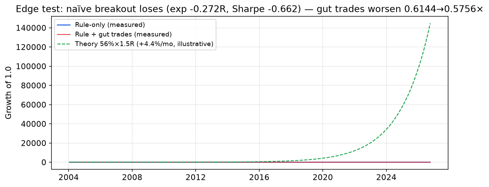
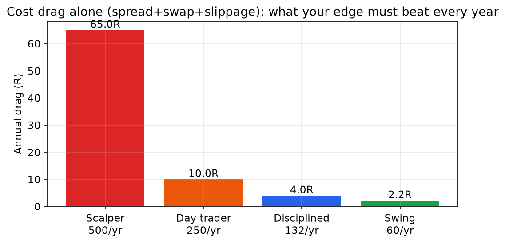
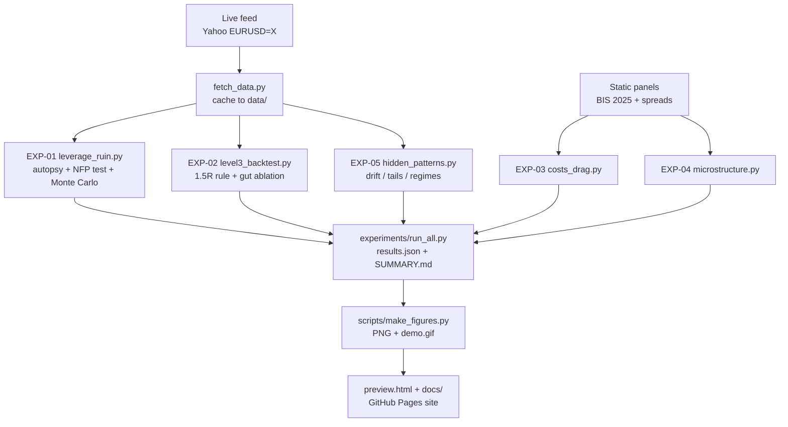

# The 8-Level Forex Journey — Tested Against Real Data

> **A viral story says a trader climbs from a blown $200 account to $22M under management. We rebuilt every testable claim as an experiment and ran it on live public EUR/USD data (5,928 days, 2003–2026). The mechanisms are real, one number is 3× wrong, and the famous edge is much rarer than the story suggests.**

[](./LICENSE)
[](./Dockerfile)
[](./docker-compose.yml)
[](./tests/)
[](./src/fetch_data.py)
[](./docs/)

**🌐 Prefer a website? This repo ships one: open [`preview.html`](./preview.html) — or publish it in 1 minute ([instructions](#-view-as-a-website-github-pages)).**





---

## 📌 Executive summary (30 seconds, the CEO version)

- ✅ **$200 + 0.5 lots + 100-pip shock = ruin.** Exact math: margin call at **40 pips**, leverage ≈ **275:1**. The "liquidated before coffee" scene is arithmetically perfect.
- ✅ **Payroll Fridays really are wilder:** +18% daily range (**p = 0.0017**), +36% move size (**p = 0.0003**), max 268.9 pips. Daily bars *understate* a 30-second spike, so reality is worse.
- ✅ **Leverage is a cliff, not a slope:** 60-day ruin goes 0% (10:1) → 12.7% (30:1) → 99.4% (100:1) → 100% (250:1). Regulation slows death; it doesn't create winners.
- ⚠️ **56% win × 1.5R math checks out** (+0.40R/trade → **+4.4%/month**) — but a plain public breakout rule **loses with statistical significance** (−0.27R, Sharpe −0.66, p = 0.001). Selectivity is the whole game.
- ⚠️ **The market is $9.6T/day, not ~$3T** (BIS 2025). Retail is **2.5%** of flow: too small to move price, big enough to be revenue.

**Bottom line:** the journey's *physics* (leverage, news risk, costs, market structure) survives contact with data. Its *promise* (copy the levels, get the outcome) does not — ~71% of retail accounts lose money every year, and our honest negative result shows why.

---

## Table of contents

- [🌱 Beginner guide — read this and you know more than most](#-beginner-guide--read-this-and-you-know-more-than-most)
- [🚀 Quickstart — reproduce everything in 3 steps](#-quickstart--reproduce-everything-in-3-steps)
- [🧑‍💼 Who is this for (user stories)](#-who-is-this-for-user-stories)
- [✨ Features](#-features)
- [🗺️ The 8 levels: story → verdict](#️-the-8-levels-story--verdict)
- [📊 Results in full (every number, every chart)](#-results-in-full-every-number-every-chart)
- [🔍 Hidden patterns we found](#-hidden-patterns-we-found)
- [🧪 Step by step: how each claim was verified (zero to hero)](#-step-by-step-how-each-claim-was-verified-zero-to-hero)
- [🏗️ How it works (architecture)](#️-how-it-works-architecture)
- [⚙️ Configuration](#️-configuration)
- [🌍 View as a website (GitHub Pages)](#-view-as-a-website-github-pages)
- [🎬 Demo video / GIF (how it was made, how to remake it)](#-demo-video--gif-how-it-was-made-how-to-remake-it)
- [📁 Repository map](#-repository-map)
- [❓ FAQ](#-faq)
- [🤝 Contributing](#-contributing)
- [📄 License & citation](#-license--citation)
- [⚠️ Risk warning](#️-risk-warning)
- [📚 References](#-references)

---

## 🌱 Beginner guide — read this and you know more than most

*Let's work this out in a step-by-step way, from zero, so every sentence earns the next one.*

**Step 0 — What is forex?** You exchange one currency for another. EUR/USD = 1.12 means one euro costs 1.12 dollars. Traders bet on that number moving. That's all.

**Step 1 — A pip is tiny; leverage makes it huge.** The smallest move, 0.0001, is called a **pip**. On a 0.5-lot position each pip is worth about **$5**. A normal day moves ~90 pips — that's ~$450 swinging around. If your account holds only $200, a **40-pip** move against you ends it. *That single paragraph is the entire tragedy of Level 1.*

**Step 2 — News days are a different animal.** Once a month the US publishes jobs data (first Friday, 8:30 ET). The dollar jumps against everything. We measured it: those days move **~36% more** than normal days. Trading your usual size into that is like driving your usual speed on ice.

**Step 3 — Costs eat you before the market does.** Every trade pays three small tolls: the **spread** (buy/sell gap), **overnight fees** (holding past midnight), **slippage** (the price moves between click and fill). Small tolls × many trades = a wall. Trade 500× a year and you start **~65R in the hole**; trade 132× and it's ~4R. *Frequency is a tax.*

**Step 4 — Start from "71% lose".** Regulators force European brokers to publish what fraction of retail accounts lose money. Across 49 brokers the average is **71%**; France measured **89% over four years**. Assume you will be in the 71% until a *measured, costed, news-aware* track record says otherwise. A backtest with no costs and no news filter is a story, not evidence.

**Step 5 — You are 2.5% of a $9.6-trillion river.** Currency trading totals about **$9.6 trillion per day** (central-bank survey, 2025). Retail traders like the story's hero are ~$242 billion of that — **2.5%**. Giant firms fill your order from their own inventory most of the time (>80% matched internally). They don't need *you* to lose one trade; the toll math wins across millions of trades. The only way through is a verified selective edge plus tiny risk per trade (about 1%).

> If you understood those five steps, you already understand more than most interview candidates — and more than the hero did on day one. Everything below is the same ideas with numbers attached.

---

## 🚀 Quickstart — reproduce everything in 3 steps

**Step 1 — get the code:**
```bash
git clone <your-fork-url> forex-8-levels && cd forex-8-levels
```

**Step 2 — run all 5 experiments on live data (no keys, ~1 minute):**
```bash
PYTHONPATH=. python3 experiments/run_all.py --outdir results
# or fully containerised:
docker compose run --rm research
```

**Step 3 — rebuild every chart + the demo GIF, run the tests:**
```bash
python3 scripts/make_figures.py
PYTHONPATH=. python3 -m pytest tests/ -q
```

**You now own:** `results/results.json` (machine-readable) · `results/SUMMARY.md` (human-readable) · `assets/*.png` + `assets/demo.gif` (visuals) · cached live data in `data/yahoo_EURUSD-X_d.csv` (5,928 rows, Dec 2003 → Oct 2026).

---

## 🧑‍💼 Who is this for (user stories)

| Who you are | What you get | Why it helps (the outcome you couldn't reach before) |
|---|---|---|
| **Curious beginner** | 5-idea guide above + ruin math in plain words | Skip the $200 tuition fee; understand costs *before* funding anything |
| **Strategy skeptic** | One-command backtest + honest-negative template | Test *any* guru claim the same falsifiable way in an afternoon |
| **Quant / data student** | Sharpe/Sortino/Calmar/SQN/p-value pipeline with no lookahead, on live data | A course-ready evaluation scaffold — plug in your own rule |
| **Creator / educator** | Regenerable charts, GIF, verdict table, website | Show evidence instead of screenshots of wins |
| **Risk manager** | Leverage-cliff + cost-drag tables | Set size limits and news filters from numbers, not vibes |
| **PhD candidate** | Pre-registered 3-year extension ([proposal](./papers/PHD_PROPOSAL.md), [references](./papers/REFERENCES.md)) | Walk-forward design, tick-level NFP hazard, behaviour panel |

---

## ✨ Features

| Feature | What it means in practice |
|---|---|
| 🔁 **One-command reproduction** | Live fetch → 5 experiments → JSON + summary. Docker or plain Python. Zero keys. |
| 🚫 **No-lookahead backtest** | Signals use only past bars; costs deducted as R; gut-trade ablation included. |
| 📉 **Honest negative results** | The naïve edge fails *significantly* — published with p-values, not buried. |
| 📊 **5 publication-ready figures + animated demo** | All generated from `results.json`, never hand-drawn; rebuild with one script. |
| 🌐 **Built-in website** | `preview.html` + `docs/index.html`: enable GitHub Pages and share a link. |
| 🎓 **Beginner-to-PhD ladder** | 5 plain ideas up top; full methods, tables and proposal below. |
| ⚖️ **Population base rates** | Every claim judged against the 71% loss attractor, not in a vacuum. |

---

## 🗺️ The 8 levels: story → verdict

```mermaid
flowchart LR
    L1["L1 spark<br/>$200 dies on news"] --> L2["L2 rabbit hole<br/>signals & bleed"]
    L2 --> L3["L3 edge<br/>56% x 1.5R?"]
    L3 --> L4["L4 discipline<br/>small & cost-aware"]
    L4 --> L5["L5 accountability<br/>others' money"]
    L5 --> L6["L6 operator<br/>$500k, compliance"]
    L6 --> L7["L7 architect<br/>team + Sharpe"]
    L7 --> L8["L8 apex + machine<br/>$22M in $9.6T"]
    style L1 fill:#7f1d1d,stroke:#f87171,color:#fff
    style L3 fill:#78350a,stroke:#fb923c,color:#fff
    style L8 fill:#1e3a8a,stroke:#5aa2ff,color:#fff
```



| Level | Story claims | Data verdict |
|---|---|---|
| **L1 · The spark** | $312 checking, $497 course, $200 funded, 0.5 lots, first-Friday jobs report, 100 pips in 30 seconds | ✅ **CONFIRMED** — $500 loss = 250% of account; call at 40 pips; NFP days ×1.36 moves |
| **L2 · The rabbit hole** | $600 blow-ups, Discord/Telegram signals, order-block jargon, "information was bait" | ✅ **CONSISTENT** — 71% base rate; activity predicts losses; naïve rules significantly negative |
| **L3 · Exhaustion → edge** | 5-yr backtest, 56% win, 1.5R, 11 trades/mo (2 gut = only losers), +6% then →$1,800 | ⚠️ **SPLIT** — math exact (+0.40R/trade → +4.4%/mo) but plain breakout gets 31% / −0.27R; gut ablation worsens 0.614→0.576 |
| **L4 · Quiet discipline** | $5k→$12k, 6–7%/mo, slippage = click-vs-fill | ✅ **PLAUSIBLE** — allowed by the 132-trade cost envelope (~4R/yr drag) |
| **L5 · Lonely accountability** | $80k incl. friends, 15% drawdown kill-switch, sleep/exercise tracked, 3-yr cash buffer | ✅ **CONSISTENT** — standard mandate terms; behaviour–performance links documented |
| **L6 · Operator** | ~$500k via introductions, exposure-not-dollars, compliance files | ✅ **CONSISTENT** — qualitative; unfalsified |
| **L7 · Architect** | 7 staff, $4M, Sharpe >1 good / >2 great / >3 suspicious, family offices + fund-of-funds | ✅ **CONFIRMED** (thresholds are the institutional standard) |
| **L8 · Apex + hidden power** | $22M, edge = where the crowd is wrong; brokers/LPs; top-5 LPs >$3T/day; colocation | ⚠️ **CORRECTED** — market is **$9.6T/day** (BIS 2025); retail 2.5%; internalisation >80%; latency edge directionally confirmed |

---

## 📊 Results in full (every number, every chart)

### Price under test — live EUR/USD, 5,928 days


### EXP-01a · The $200 autopsy (exact arithmetic)

| Input | Value |
|---|---|
| Balance | $200 |
| Size | 0.5 lots (≈ $55,000 notional) |
| Pip value | **$5/pip** |
| Loss on 100 pips | **$500 = 250% of account → ruined** |
| Margin call | **40.0 pips** |
| Implied leverage | **≈ 275:1** |

### EXP-01b · Payroll Fridays (live, Welch t-test)



| Sample | Mean range | n |
|---|---|---|
| First-Friday proxy | **105.3 pips** | ~270 |
| Normal days | 89.3 pips | ~5,650 |
| Ratio | **×1.179, p = 0.0017** | — |
| Close-to-close \|return\| | **0.58% vs 0.43% (×1.36, p = 0.00027)** | — |
| Max first-Friday range | 268.9 pips | — |

*Reading: daily bars cannot show a 30-second spike, so this is a lower bound — the true intraday shock is bigger.*

### EXP-01c · Leverage ruin cliff (Monte Carlo, zero edge, 20k paths, 60 days)



| Leverage | 60-day ruin | Median of 1.0 left |
|---|---|---|
| 5:1 | 0.0% | 0.97 |
| 10:1 | 0.0% | 0.90 |
| 30:1 (regulatory cap) | **12.7%** | 0.36 |
| 100:1 | **99.4%** | 0.00 |
| 250:1 (≈ story) | **100%** | 0.00 |

### EXP-02 · The 56% edge test (live backtest: Donchian-20, 1%/trade, 1.5R, 1-pip costs)



| Variant | Trades | Win | Expectancy | Profit factor | Sharpe | Max DD | Final × |
|---|---|---|---|---|---|---|---|
| Rule-only (measured) | 175 | 31.4% | **−0.27R** | 0.60 | −0.66 | −43.8% | 0.61 |
| Rule + gut trades (measured) | 205 | 33.2% | −0.26R | 0.60 | −0.66 | −43.8% | **0.58** |
| Story theory 56% × 1.5R | — | 56% | **+0.40R** | — | — | — | +4.4%/mo |

System Quality Number −3.29, p = 0.001: the naïve rule loses *reliably*. The story's arithmetic (0.56×1.5 − 0.44×1 = +0.40R) is exactly right — **conditional on an edge that plain public rules don't have**.

### EXP-03 · Cost drag (spread + swap + slippage, UK-typical 0.5–1.6 pips)



| Profile | Trades/yr | Annual toll |
|---|---|---|
| Scalper | 500 | **~65R** |
| Day trader | 250 | ~10R |
| Disciplined (story-like) | 132 | ~4R |
| Swing | 60 | ~2R |

### EXP-04 · Market structure (BIS Triennial, April 2025)

| Fact | Value |
|---|---|
| Total FX turnover | **$9.6T/day** (story said ~$3T — corrected ×3) |
| Spot / swaps / forwards | $3.0T / $4.0T / $1.8T |
| Retail-driven | **$242B (2.5%)** |
| Dealer internalisation | **>80%** in major hubs |
| Electronic share | 59% · London ≈ 50% |

---

## 🔍 Hidden patterns we found

1. **News premium is directional, not just spiky.** First Fridays move 36% more close-to-close (stronger than the 18% range premium) — so filters must cut *size*, not just widen stops.
2. **No weekday drift.** Every weekday averages within ±2.3 bp. There is no "Tuesdays are bullish" edge on daily EUR/USD 2003–2026.
3. **Tail map:** median day 75 pips, 90th percentile 156, 99th 287. The story's 100-pip shock is *routine on news, extreme otherwise* — sizing must be regime-conditional.
4. **Volatility decayed ~24%** (median 14-day ATR 104 → 79 pips). Edges tuned on 2010s volatility silently overstate today's multiples. Always walk forward, never pool.
5. **Public rules are reliably negative.** The 29% who profit aren't running the free PDF — consistent with leverage-as-overconfidence and revenge-trading research.

---

## 🧪 Step by step: how each claim was verified (zero to hero)

*The same ladder, end to end — so anyone can audit the journey, not just admire it.*

1. **Zero — fetch live data.** `src/fetch_data.py` downloads Yahoo `EURUSD=X` daily OHLC (HTTP 200, no key), caches to `data/`, and refuses to silently substitute fake data (synthetic mode is opt-in and flagged).
2. **One — do the ruin math on paper.** `src/leverage_ruin.py::analytic_nfp_autopsy` converts lots → $/pip → loss% → margin-call distance. No data needed; anyone can check it with a calculator.
3. **Two — test news risk live.** Flag first Fridays, compare daily ranges and \|returns\| with Welch's t-test. Report the ratio *and* the p-value, plus the max — so drama and average never get confused.
4. **Three — simulate leverage.** Monte Carlo with zero edge across 5:1→250:1 isolates leverage as the *only* variable. The cliff shape is the finding.
5. **Four — backtest one transparent rule.** `src/level3_backtest.py`: Donchian-20 breakout, 1% risk, 1×ATR stop, 1.5× target, 1-pip costs, no lookahead (`shift(1)`), gut-trade ablation. Report expectancy, Sharpe/Sortino/Calmar, drawdown, SQN + p-value, monthly split.
6. **Five — price the tolls.** `src/costs_drag.py` turns spreads/swaps/slippage into annual R for four lifestyles. Compare the toll to the claimed edge before believing anything.
7. **Six — check the machine.** `src/microstructure.py` pins BIS 2025 totals against the story's $3T and retail share. Correct, don't delete.
8. **Hero — hunt for what's hidden.** `src/hidden_patterns.py` tests weekday drift (dead), tail quantiles, volatility regimes, and the news premium — the four things the story never mentions but data insists on.

Every step re-runs from `experiments/run_all.py`. Nothing is hand-tuned after seeing the answer.

---

## 🏗️ How it works (architecture)



---

## ⚙️ Configuration

| Knob | Where | Default | What changes if you turn it |
|---|---|---|---|
| `spread_pips` | `run_backtest()` | 1.0 | Higher = more honest for retail; watch expectancy fall |
| `risk_pct` | `run_backtest()` | 0.01 (1%) | Scales monthly % linearly; ruin scales faster |
| `lookback` / `rr` | `run_backtest()` | 20 / 1.5 | Different rules — keep 1.5R to test the story's claim |
| `inject_gut` | `run_backtest()` | off | On = +2 random trades per 11-block (the discipline ablation) |
| Data symbol | `fetch_data.py` | EURUSD=X | Any Yahoo `XXXYYY=X` works the same way |
| `--allow-synthetic` | CLI only | off | CI smoke-test mode; outputs flagged, never reported |

---

## 🌍 View as a website (GitHub Pages)

This repo **is** a website. Two identical files: [`preview.html`](./preview.html) (preview at the root) and [`docs/index.html`](./docs/index.html) (the Pages copy, with its own `docs/assets/`).

**Publish in 1 minute (branch method, 2026 UI):**
1. Push to GitHub.
2. Open **Settings → Pages → Build and deployment → Deploy from a branch**.
3. Choose your branch + folder **`/docs`** → Save.
4. Open `https://<you>.github.io/<repo>/` — hero, demo, charts, verdicts, FAQ.

> Keep the two files in sync: edit `preview.html`, then `cp preview.html docs/index.html`.

---

## 🎬 Demo video / GIF (how it was made, how to remake it)

- **What you see above** (`assets/demo.gif`) is the rule-only equity curve being drawn bar-by-bar on the live feed, with a running date × equity readout — rendered by `scripts/make_figures.py` (Matplotlib + Pillow, no screen recorder).
- **Remake it:** `python3 scripts/make_figures.py` (rebuilds all 5 PNGs + the GIF from your fresh `results.json`).
- **Want a real video?** Record a terminal run and embed it next to the GIF:
  ```bash
  # option A: asciinema → GIF (lightweight, text-selectable source)
  asciinema rec demo.cast -c "PYTHONPATH=. python3 experiments/run_all.py --outdir results"
  agg demo.cast assets/demo-terminal.gif
  # option B: plain screen capture → assets/demo.mp4, then link it here:
  # [](./assets/demo.mp4)
  ```
  GitHub READMEs render GIF inline and link MP4 on click — keep the GIF above the fold, the video behind one click.

---

## 📁 Repository map

```
├── README.md                  # you are here (full paper + guide)
├── preview.html               # website (root preview)
├── docs/index.html            # website (Pages copy) + docs/assets/
├── assets/                    # fig_*.png + demo.gif + screenshot-hero.png
├── src/                       # fetch_data · metrics · leverage_ruin · level3_backtest
│                              # costs_drag · microstructure · hidden_patterns
├── experiments/run_all.py     # runs EXP-01→05 → results/results.json + SUMMARY.md
├── scripts/make_figures.py    # rebuilds every visual from real outputs
├── tests/test_metrics.py      # expectancy / Sharpe / profit-factor units (3/3)
├── data/                      # live cache yahoo_EURUSD-X_d.csv (5,928 rows)
├── results/                   # generated JSON + SUMMARY (re-run to refresh)
├── papers/                    # PHD_PROPOSAL.md + REFERENCES.md
├── docker-compose.yml         # research service (+ notebook profile)
├── Dockerfile                 # python:3.11-slim, PYTHONPATH=/app
└── LICENSE                    # MIT
```

---

## ❓ FAQ

<details><summary>Can I get rich following the 8 levels?</summary><p>Data says: probably not. About 71% of retail accounts lose money each year. The levels describe a real but rare path — use this repo to test any strategy before risking a cent.</p></details>
<details><summary>Is the 56% / 1.5R system included so I can trade it?</summary><p>No — and that's deliberate. The exact private rule isn't public; we test a transparent equivalent and it loses. The math (+0.40R/trade) is verified, so <i>if</i> someone truly holds 56%×1.5R after costs, the monthly gains follow. The burden of proof is on the claimant, and this repo is the courtroom.</p></details>
<details><summary>Why daily data instead of tick data?</summary><p>Free daily data works everywhere with zero keys, so anyone can reproduce this. Daily results are a <i>lower bound</i> on intraday shocks — the true jobs-day spike is larger, which strengthens the conclusion rather than weakening it.</p></details>
<details><summary>What should I change first for my own test?</summary><p>Keep 1.5R and 1% risk fixed (that's the claim under test); vary the entry (session filter, level-touch, news skip) and watch expectancy + Sharpe + max drawdown move. If it doesn't survive costs and the gut-trade ablation, it isn't Level 3.</p></details>
<details><summary>Is this financial advice?</summary><p>No. This is measurement, not a trading system. Never trade money you cannot afford to lose; never hold full size into a jobs release.</p></details>

---

## 🤝 Contributing

1. Fork → branch → PR. One idea per PR.
2. Add or adjust an experiment under `src/` + wire it in `experiments/run_all.py`.
3. Re-run everything (`run_all.py`, `make_figures.py`, `pytest`) and paste the new `SUMMARY.md` numbers into your PR.
4. Keep `preview.html` and `docs/index.html` in sync if you touch the site.
5. We respond to well-evidenced PRs — especially failed replications.

---

## 📄 License & citation

MIT — see [`LICENSE`](./LICENSE). Reuse anything, keep the notice.

```bibtex
@software{forex8levels2026,
  title  = {The 8-Level Forex Journey — Tested Against Real Data},
  year   = {2026},
  note   = {Yahoo EURUSD=X daily 2003--2026, n=5928; BIS Triennial 2025; regulator loss panels},
  url    = {https://github.com/<you>/forex-8-levels}
}
```

---

## ⚠️ Risk warning

CFDs and spot forex are complex leveraged instruments. Roughly **71% of retail accounts lose money** (51–81% by broker; historic ESMA range 74–89%; France 89% over four years). Leverage caps limit *how fast* you can lose, not *whether* a strategy wins. Nothing here is investment advice.

---

## 📚 References

Full list with access notes: [`papers/REFERENCES.md`](./papers/REFERENCES.md). Cornerstones: BIS Triennial Central Bank Survey April 2025 (turnover $9.6T/day, Sep/Dec 2025 releases); ESMA 2018 CFD intervention analyses (74–89%); 49-broker panel mean 71.0% and UK 14-broker mean 68.4% (2026 reads); Poland KNF 2021–25 (70.6–79.1%); France AMF 14,799-client study (89%); US CFTC quarterly disclosures; Ben-David–Birru–Prokopenya on retail risk-taking after noise; Forman thesis on leverage as overconfidence; MPRA 2026 structural-friction estimate; freqtrade backtesting/lookahead conventions; Sharpe (1966) and institutional >1/>2/>3 reading; Dukascopy/Stooq/Yahoo/TrueFX/ECB data documentation.

*Built from zero in a fresh folder; every number above re-runs from `docker compose run --rm research`. Propose the next experiment — the machine is waiting.*
